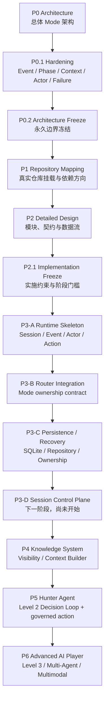

# Game Mode Development Roadmap

- 文档类型：RFC / Development Roadmap
- 状态：Active Navigation Baseline
- 当前分支：`feature/game-mode-runtime-v01`
- 当前代码基线：`057c610160babbbc4cd3750410484e6e710af798`
- 当前阶段：P3-C Persistence / Recovery completed；P3-D Session Control Plane not started
- 最高约束：[Architecture Freeze P0.2](game-mode-architecture-freeze.md)、[Implementation Constraint Freeze P2.1](game-mode-implementation-freeze.md)
- 用途：为 ChatGPT、Codex 和新开发者提供阶段导航；本文不替代任何详细设计或冻结 ADR

## 文档权威性

本文汇总既有架构与实施状态，不重新设计 Game Mode。发生冲突时，以 P0.2 Architecture Freeze 和 P2.1 Implementation Constraint Freeze 为准；任何冻结决策只能由新的 ADR 显式替代。

当前路线命名与 P2.1 Decision 23 存在一处需要人工统一的差异：P2.1 将 `P3-D` 命名为 Hunter Agent Loop、`P3-E` 命名为 Action Execution；本路线将下一项工作命名为 `P3-D Session Control Plane`，并把 Knowledge 与 Hunter 分别规划为 P4、P5。本文仅记录新的程序路线，不隐式覆盖 Decision 23。进入 P3-D 实现前，必须先通过 P3-D Design Freeze 或补充 ADR 明确阶段编号、与原 P3-D/P3-E 的映射及准入顺序。

## 1. Project Vision

Game Mode 是 Agent Runtime 的独立顶层 Runtime Mode：

```text
Agent Runtime
├── Normal Mode
└── Game Runtime
```

它不是 Plugin、Tool 或 `play_script_game()` 式单次函数调用。薄 Plugin 未来只能承担 NoneBot/OneBot 协议接入，不能拥有 Game Session、Knowledge、Reasoning、Action Queue 或生命周期。

目标角色是：

```text
Hunter Game Agent
Level 2 AI Player
```

Hunter 负责理解环境、形成结构化推理、决定是否行动并通过受控通道行动。Hunter 不拥有系统权限，也不直接管理 Session、可见性或持久化。Runtime 负责：

- Session Lifecycle 与 Game Phase；
- Participant、DM 和 Character Identity；
- Knowledge Visibility 与 Disclosure；
- Event 顺序、Actor 单写者和恢复；
- Action Authorization、Audit、Idempotency 和失败收束；
- Game Memory 隔离、Episode Summary 和 T+5 清理。

最终目标不是 AI 主持人，而是在真人 DM 控制下、能够观察、推理、判断何时发言或等待的 Level 2 AI 玩家。

## 2. Architecture Evolution Timeline



阶段编号兼容规则：P3-D 之前先完成新的 Design Freeze/ADR；P5 中的 Hunter Loop 与 Action Execution 必须继续保持 P2.1 所冻结的先后关系，不能因路线重命名而合并为一次实现。

## 3. Completed Phase Summary

### P0 Architecture

目标是建立 Game Mode 总体架构。核心结论：Game Runtime 与 Normal Mode 并列；Game Mode 是长期、有状态的 Runtime，不是 Plugin 或 Tool；DM 是单局控制者；Game Identity、Knowledge、Reasoning 和 Memory 必须隔离。

基线文档：[Game Mode P0 Architecture](game-mode-p0-architecture.md)。

### P0.1 Hardening

补齐工程实现前的 Runtime 基础协议：GameEvent、Lifecycle/Phase 分离、Context Builder、Hunter Instance、Action Queue、Session Actor 并发和 Failure Model。冻结 Event 是唯一状态推进输入、同局单 Writer、外部副作用先排队以及 UNKNOWN 不自动重试。

基线文档：[P0.1 Hardening](game-mode-p0.1-hardening.md)。

### P0.2 Architecture Freeze

冻结以下长期决策：

- 顶层 `game_runtime/`，不进入 Plugin、Tool 或 Memory 子模块；
- `RUNNING/PAUSED` 游戏群消息由 Game Runtime 独占；
- Shared Audit Engine + `domain=GAME`；
- 独立 Game State DB + Event Store；
- T+0 生成白名单 Episode Summary，T+5 删除单局内容；
- V0.1 单进程 Lightweight Hunter Instance；
- V0.1 只启用 `GROUP_TEXT`。

权威文档：[Architecture Freeze P0.2](game-mode-architecture-freeze.md)。

### P1 Repository Mapping

完成真实仓库结构、消息入口、Normal Agent、Memory、Audit、Authorization、Gateway 和 Metadata 的映射；确定 Game Runtime 顶层挂载位置、薄 ingress 边界、可复用共享基础设施和禁止依赖方向。

基线文档：[P1 Repository Mapping](game-mode-p1-repository-mapping.md)、[Implementation Placement](game-mode-implementation-placement.md)。

### P2 Detailed Design

完成 Session Manager、Participant Registry、Knowledge Policy、Context Builder、Reasoning Space、Timeline Engine、Decision Engine、Action Planner/Queue、Communication Adapter、Memory/Retention 和 Failure/Recovery 的模块契约与数据流设计。

基线文档：[P2 Detailed Design](game-mode-p2-detailed-design.md)。

### P2.1 Implementation Freeze

冻结 LLM Interface、Event Store、Knowledge Store、Reasoning Trigger、Action Persistence、Episode Summary、Setup Control Plane 和 P3 分阶段实施约束。明确禁止跨阶段一次实现完整 Game Mode。

权威文档：[Implementation Constraint Freeze P2.1](game-mode-implementation-freeze.md)。

### P3-A Runtime Skeleton

已实现：

- Session Model 与 Lifecycle/Phase；
- GameEvent；
- 单 Session Actor 骨架；
- Action Queue 状态机；
- Identity、Participant 和基础 Port。

Checkpoint：`cbf8200852cf7fe37592bc353db5742bc98306d4`，`feat(game-mode): add runtime skeleton foundation`。

### P3-B Router Integration

已实现平台无关的 Game Router、Session Registry、Message Envelope、Route Decision、GameEvent Factory 和 Actor Ingress。路由优先级冻结为：

```text
Global Control Plane
        |
Active Game Session
        |
Normal Mode
```

Registry 或 Game ingress 故障必须 fail closed，不能回落 Normal Mode。当前只完成路由 contract，生产消息接管未启用。

Checkpoint：`170964467d4aa9d69a276deb37e0dc03f4e5b403`，`feat(game-mode): add runtime routing integration`。

### P3-C Persistence / Recovery

已实现：

- Game Runtime 专用 SQLite schema 与版本管理；
- Session/Participant/Event/Action Repository；
- append-only Event Envelope 与 processing projection；
- Snapshot、cursor、Event processing 的原子 Apply；
- 持久 group ownership 与 generation；
- clean/unclean restart recovery；
- `EXECUTING -> UNKNOWN` 安全恢复；
- 单进程 Actor ownership 冲突保护。

Checkpoint：`057c610160babbbc4cd3750410484e6e710af798`，`feat(game-mode): add persistence and recovery layer`。

生产 Message Ingress、LLM、QQ Action、Knowledge 和长期 Memory 仍未启用。

## 4. Current Architecture Status

当前已验证的逻辑能力：

```text
Platform-neutral Message Envelope
        |
Mode Router Contract
        |
Game Runtime Ingress
        |
GameSession Actor
        |
SQLite Persistence
        |
Restart Recovery + Ownership
```

已经具备：

- Session Lifecycle/Phase 的领域状态；
- Game/Normal 的消息归属判断 contract；
- 同局 Actor 单写者基础；
- Session、Participant、Event、Action 状态保存；
- Event 顺序、去重、State Version 和 cursor；
- clean restart 恢复与异常 restart 安全暂停；
- UNKNOWN Action 的持久安全语义。

尚未实现：

- 生产 NoneBot/OneBot Message Ingress 接管；
- DM Session Control Plane；
- Session 创建、开始、暂停、恢复、结束的正式控制 API；
- Knowledge Store、Visibility Policy 和 Context Builder；
- Hunter Instance 的 Observe/Reason/Decide Loop；
- Timeline/Reasoning 业务实现；
- Shared GAME Action governance 与 QQ `GROUP_TEXT` Executor；
- Episode Summary 写入和 T+5 调度执行。

因此，“消息归属、状态保存和恢复”已具备基础设施，但当前尚不是可运行的剧本杀 AI Player 产品。

## 5. Future Development Roadmap

### P3-D Session Control Plane

目标：建立由真人 DM 驱动、受 Session Policy 约束的游戏控制面。

范围：

- 创建 Session；
- 开始、暂停、恢复和结束；
- 合法 Game Phase 推进；
- Participant 管理、替换与离场；
- Hunter Character 绑定；
- Session Setup/Repair contract；
- expected `state_version`、Authorization、Audit、必要 Confirmation 和 Idempotency；
- 失败时保留 ownership 并安全暂停。

权限原则：

```text
DM = Game Session Controller(game_id)
DM != System Admin
```

DM 不能修改系统配置、操作 Normal Mode、调用普通 Agent Tool、访问其他 Session 或获得 Global Permission。V0.1 群内 DM 命令只能承载全群可公开信息；Character Private Knowledge 和 Hidden Truth 只能在启动前通过受信 Setup Control Plane 预置，或暂停后通过受信 Repair 流程更新。

准入要求：先创建 P3-D Design Freeze/补充 ADR，解决本文开头记录的阶段编号差异；随后才能实现。P3-D 不接 LLM、不实现 Hunter 决策、不发送 QQ 消息。

### P4 Knowledge System

目标：建立统一建模、强分区隔离的单局知识系统：

```text
Knowledge Store(game_id)
├── Public Knowledge
├── Character Private Knowledge
├── Hidden Truth
└── Reasoning Space
        |
Visibility Policy
        |
Context Builder
        |
Hunter Context Package
```

范围包括 Knowledge provenance、Phase 有效性、Clue/Evidence/Statement、结构化 Timeline、Visibility Policy、Disclosure Manifest、最小 Context Builder 和泄漏负向测试。

永久规则：Hidden Truth 不得进入 Hunter Player Context、Reasoning、Action payload、Audit 或日志。完整剧本不能作为一个未分区对象直接交给 Player LLM。Context Builder 不读取 Companion/User/Semantic Memory，也不读取 Episode Summary。

### P5 Hunter Agent

目标：实现 Level 2 AI Player：

```text
Observe
  -> Understand
  -> Reason
  -> Decide
  -> Act or WAIT
```

能力包括：

- 识别 Participant、Statement、Question、Clue 和 Phase；
- 维护结构化 Hypothesis、Evidence Reference、Conflict、Unknown 和 Confidence；
- 判断是否回答、主动公开发言、询问 DM 或等待；
- 通过 Context Builder 使用最小可见知识；
- 通过 Action Intent 表达行动，不直接产生副作用。

P5 必须至少分成两个独立冻结与交付门槛：

1. Hunter Loop：LLM Interface、Trigger Policy、结构化 Reasoning、Decision、无 CoT/Hidden Truth 泄漏；
2. Action Execution：Authorization、Shared Audit `domain=GAME`、Confirmation、Idempotency、Disclosure 和仅 `GROUP_TEXT` Executor。

该先后关系对应 P2.1 原冻结的 P3-D Hunter Agent Loop → P3-E Action Execution。不能因为 roadmap 将其归入 P5 而一次实现或倒序启用。

### P6 Advanced Capability

候选方向：

- Timeline Engine 增强与更复杂的冲突解释；
- Level 3 主动策略和有限社交推理；
- 受控私聊；
- 多 AI 角色；
- AI DM；
- 图片、语音和多媒体剧本；
- Voice Agent；
- 必要时的多进程/分布式 Actor。

这些能力均不属于 V0.1。私聊、AI DM、多 Agent、多模态、Global/Vector Memory 或分布式 ownership 需要独立 ADR、Capability 默认关闭和新的权限/可见性模型，不能通过调整 Prompt 或复用 Hunter 权限隐式开启。

## 6. Permanent Architecture Constraints

### Mode 隔离

- Game Runtime 是顶层 Mode，不是 Plugin、Tool、Agent Tool 或 Memory 子模块。
- 无活动 Session 时 Normal Mode 行为不变。
- `RUNNING/PAUSED` 群消息只属于 Game Runtime；错误也不能回落 Normal Mode。
- 游戏消息不能进入普通 Chat History、Message Archive、Companion Memory、Semantic Graph 或 Daily Report。

### Permission 隔离

- DM 权限只绑定当前 `game_id + participant_id + binding_version`。
- DM 不能修改系统配置、操作 Normal Mode、调用 Global Tool、查看其他 Session 或获得 System Admin 权限。
- System Admin 不会自动成为某局 DM；Global Control Plane 与 Session Control Plane 必须分离。

### Memory 隔离

- 所有 Game State、Event、Knowledge、Reasoning 和 Action 按 `game_id` 隔离。
- 禁止跨局检索、学习、玩家画像或角色状态复用。
- 游戏秘密、玩家行为和 Game Character 不得污染长期人格或普通 Memory。
- Game Context Builder 禁止读取 Companion/User/Semantic/Graph Memory。

### Knowledge 隔离

- 完整剧本不能直接进入 Player Context。
- Knowledge Store 必须经过 Visibility Policy 和 Context Builder。
- Hidden Truth 永不进入 Hunter Context；合法揭示必须产生新的可见 Knowledge Record。

### Reasoning 隔离

- 禁止保存完整 Chain of Thought、旧 Prompt 或模型自由文本思考。
- 只保存结构化 Hypothesis、Evidence Reference、Conflict、Unknown、Confidence 和状态变化。
- 普通消息不能直接触发深度 Reasoning；只能先派生冻结 Trigger。

### Event 与 Action 隔离

- GameEvent 是状态推进的唯一输入；QQ Handler、LLM callback 和 Executor 不能直接写 Session State。
- 同一 Session 只有一个 State Writer；同局串行，不同局可并行。
- 所有外部或高影响副作用先持久化 Action，再经过 Authorization、Audit、Idempotency，必要时 Confirmation。
- `UNKNOWN` 不自动重试，也不能被推定为成功或失败。

### Episode Summary 与 Retention

- Episode Summary 使用独立 `GAME_EPISODE` Memory Namespace，目标约 100 个中文字符。
- 允许：日期、剧本名称、参与者公开表示、Hunter 角色、最终胜负和 MVP。
- 禁止：凶手身份、剧本秘密、推理过程、私密线索、玩家评价/画像、QQ ID 和隐藏剧情。
- Episode Summary 是进入长期 Agent Memory 的唯一受控例外，且不能用于新局 Context。
- T+5 必须删除 Session、Event、Participant、Knowledge、Timeline、Reasoning、Private Knowledge、Hidden Truth 和 Action payload；Summary 或复盘失败不能取消清理。

### V0.1 通信边界

- V0.1 只启用 `GROUP_TEXT`。
- 主动私聊、DM 私聊、临时会话、语音和图片保持 unavailable。
- 通道失败不能降级为群内公开发送。

## 7. Development Workflow Rule

每个阶段必须遵循：

```text
Architecture Review
        |
Design Freeze / ADR
        |
Scoped Implementation
        |
Contract + Isolation + Full Regression Tests
        |
Checkpoint Commit
        |
Push
        |
Human Confirmation
        |
Next Phase
```

工程规则：

1. 不跳过设计冻结，不在未确认时提前写下一阶段代码。
2. 每次实现只使用显式 allowlist，并记录 non-goals。
3. 不通过实现便利、Prompt 或局部重构隐式修改冻结架构。
4. 发现冲突时停止实现；通过新 ADR 解决，不直接改旧文档掩盖冲突。
5. 每阶段必须证明 Normal Mode 不变、Game 数据不进入普通 Memory、DM 不越权、失败不 fail open。
6. Commit 与 Push 分开执行；除非任务明确授权，不自动 commit、push、merge、rebase 或创建 PR。
7. 下一阶段只能在 checkpoint 验证和人工确认后开始。

## 8. Navigation Index

|主题|权威或详细文档|
|---|---|
|永久架构决策|[Architecture Freeze P0.2](game-mode-architecture-freeze.md)|
|总体架构|[P0 Architecture](game-mode-p0-architecture.md)|
|Runtime 硬化|[P0.1 Hardening](game-mode-p0.1-hardening.md)|
|仓库挂载|[P1 Repository Mapping](game-mode-p1-repository-mapping.md)、[Implementation Placement](game-mode-implementation-placement.md)|
|详细模块设计|[P2 Detailed Design](game-mode-p2-detailed-design.md)|
|实施约束|[Implementation Freeze P2.1](game-mode-implementation-freeze.md)|
|Router|[P3-B Router Design](game-mode-p3b-router-integration-design.md)|
|Persistence/Recovery|[P3-C Persistence Design](game-mode-p3c-persistence-design.md)|

本文只提供方向、状态和入口。任何阶段的实现细节必须进入对应 Design Freeze，不得直接从 roadmap 推导生产行为。
